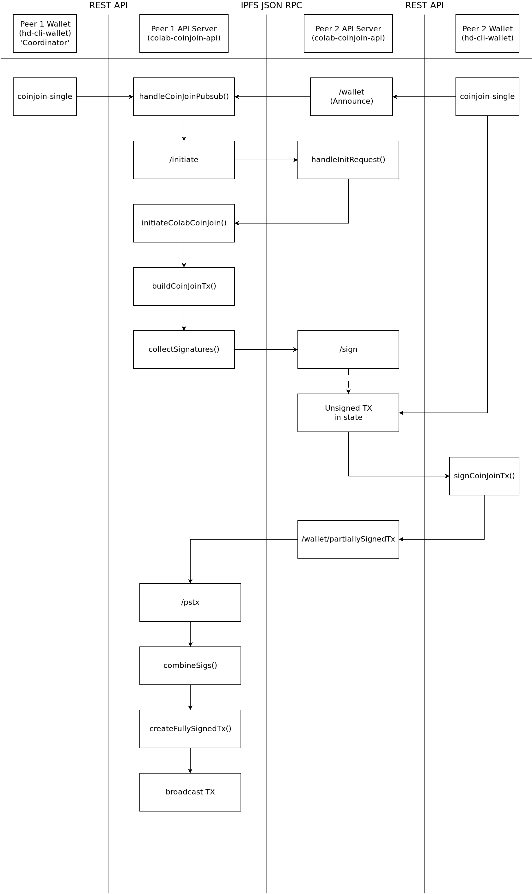

# CoinJoin Workflow

The flowchart below illustrates how messages are passed between peers to collaborate on a CoinJoin transaction. Each peer has a wallet ([hd-cli-wallet](https://github.com/bch-coinjoin/hd-cli-wallet)) and access to an instance of this colab-coinjoin-api (*API server*). Wallets and *API servers* pass information using a REST API. *API servers* talk to one another using a JSON RPC via [IPFS](https://ipfs.io) pusub channels.

The diagram below shows the workflow of creating a CoinJoin transaction with two peers. One peer is always chosen as a 'coordinator'. The coordinator is the peer that initiates the Collaborative CoinJoin session, compiles the final transaction, and broadcasts it. In the example below, **Peer 1** is the coordinator.

## Initiating a CoinJoin Transaction
All peers begin the Collaborative CoinJoin protocol the same way. The wallet makes a call to the `POST /wallet` REST API endpoint of their local *API server*. With that call, the wallet passes information about the UTXOs that it wants to consolidate through a CoinJoin transaction. The *API server* will periodically announce its desire to join a CoinJoin transaction by [soliciting for CoinJoin Participation as per the Collaborative CoinJoin specification](https://github.com/Permissionless-Software-Foundation/specifications/blob/master/ps004-collaborative-coinjoin.md#5-soliciting-for-coinjoin-participation).

As new announcements are made, each instance of the *API server* will track the other potential CoinJoin peers. Once any peer has detected enough potential peers to start a Collaborative CoinJoin, it will initiate a round by calling the `/initiate` JSON RPC endpoint on the selected peers. Each peer will respond with the UTXOs they want to add to the transaction.

## Building a CoinJoin Transaction
If all peers respond to the coordinator-peer, then the coordinator-peer will execute its `initiateColabCoinJoin()` function to compile all the information from the peers into an unsigned CoinJoin transaction. It then sends a copy of the unsigned CoinJoin transaction to each peer.

Once a peer receives the unsigned transaction, it will pass it on to the wallet. The wallet will poll an endpoint on the *API server*, to detect when an unsigned transaction has arrived. Once detected, the wallet software will validate the transaction and then sign the inputs that belong to the wallet. The partially signed transaction is then passed from the wallet to the *API server* via the REST API. The *API server* then passes the partially signed transaction to the coordinating-peer via the `/pstx` IPFS JSON RPC.

## Broadcasting a CoinJoin Transaction
The coordinating-peer will collect the partially signed transactions from all peers. Once they have all been collected, the coordinating-peer will compile them into a fully signed transaction and broadcast it to the BCH network.
